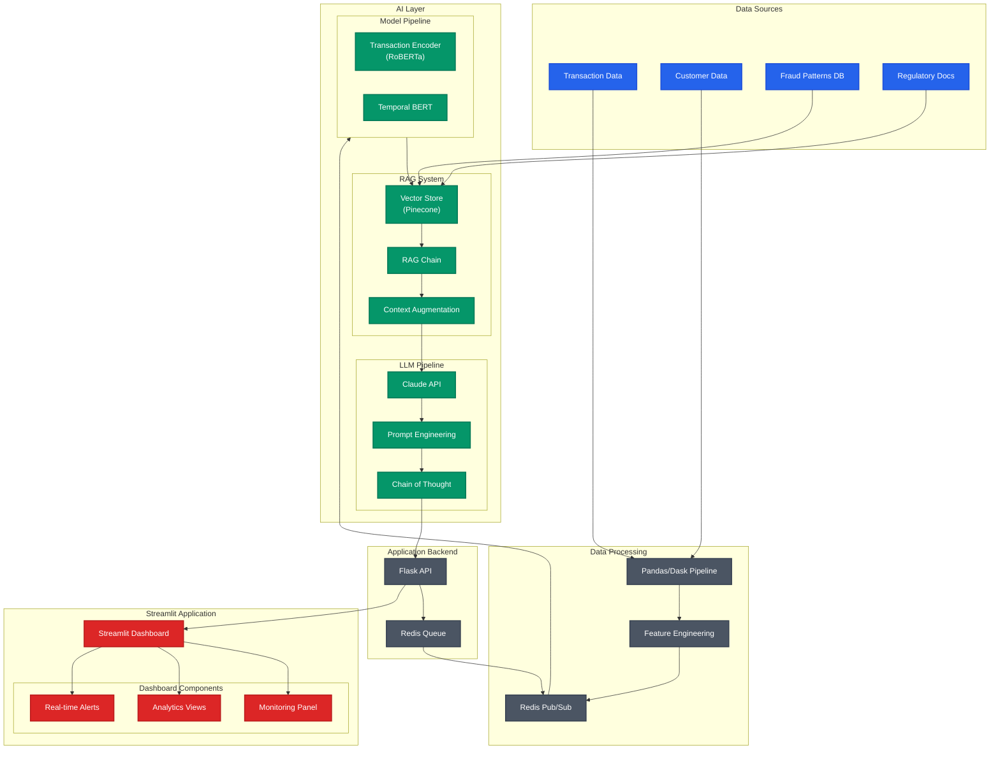
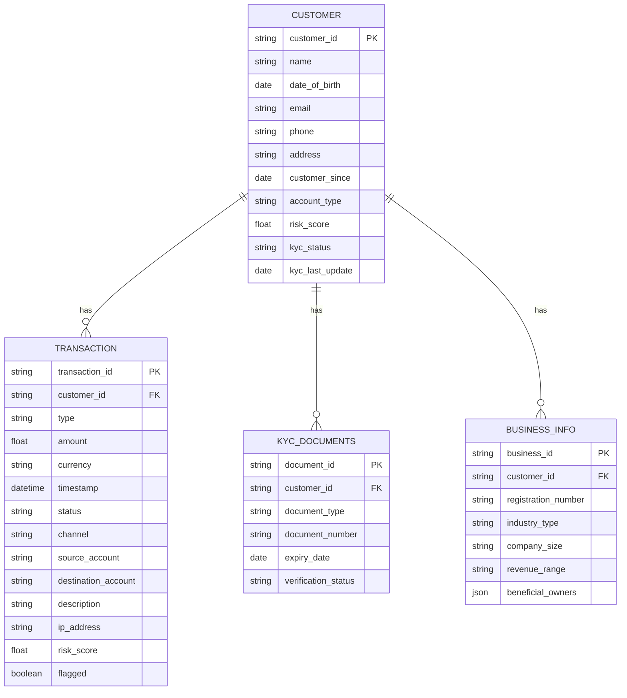
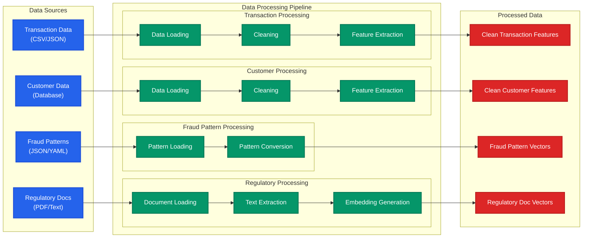

# FraudGuardAI - Intelligent Financial Fraud Detection using LLM and RAG

FraudGuardAI is an innovative fraud detection and regulatory compliance system that leverages the power of Large Language Models (LLMs) and Retrieval-Augmented Generation (RAG) to provide real-time fraud detection, context-aware transaction monitoring, and automated regulatory compliance checks.

# Flow Diagram

## Probable Data Structure (Initial perception)

## Data Pipeline Architecture

